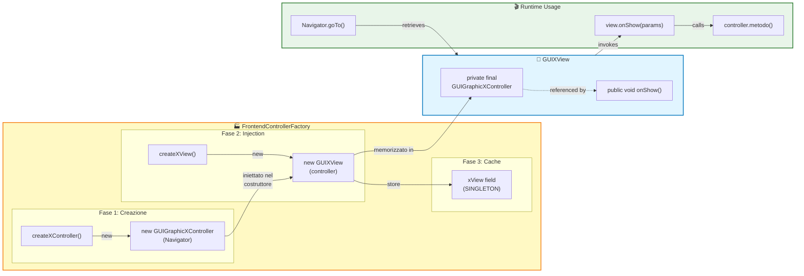
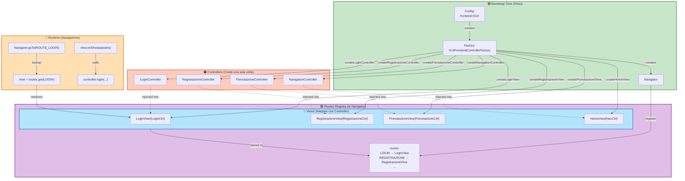
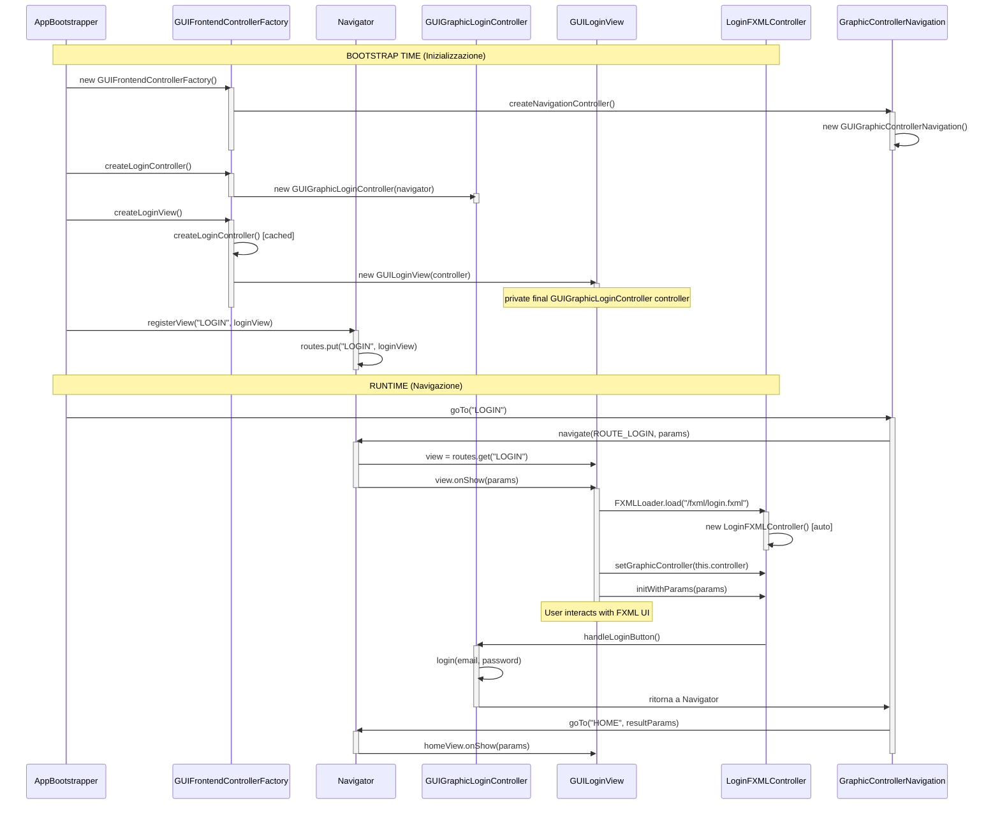
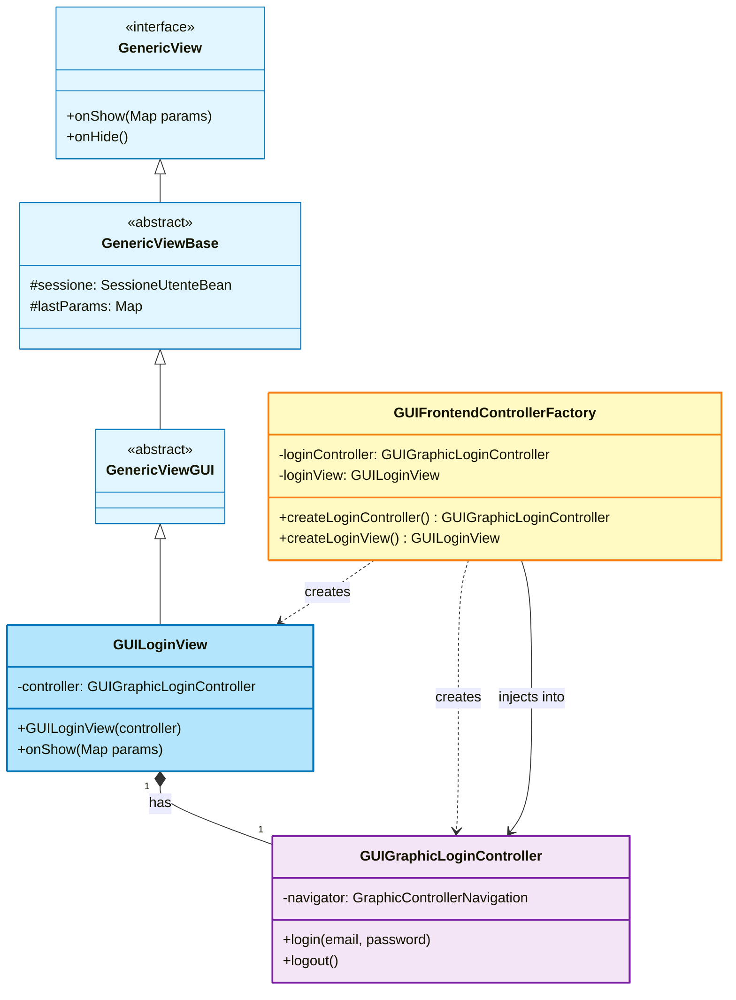
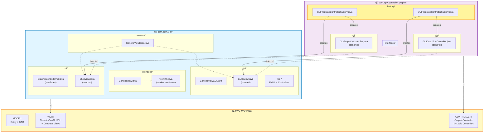

# 🎨 MVC DIAGRAM - View-Controller Injection Pattern

## 1. DIAGRAMMA MVC COMPLETO CON INJECTION

```mermaid
graph TD
    subgraph MVC["🏗️ ARCHITETTURA MVC (7 LAYER + BOOTSTRAP)"]
        subgraph Layer0["⚙️ LAYER 0: BOOTSTRAP"]
            B["AppBootstrapper"]
            BC["AppConfigurator"]
            B -->|seleziona frontend| BC
        end

        subgraph Layer1["🎨 LAYER 1: VIEW (Presentazione)"]
            V0["GenericView (interface)"]
            V1["GenericViewBase (abstract)"]
            V2["GenericViewGUI / GenericViewCLI"]
            V3["GUIXView / CLIXView (concrete)"]
            FXML["FXML Controllers (GUI only)"]
            
            V0 -.->|implements| V1
            V1 -->|extends| V2
            V2 -->|extends| V3
            V3 -->|carica FXML| FXML
        end

        subgraph Factory["🏭 FRONTEND CONTROLLER FACTORY"]
            F["GUIFrontendControllerFactory<br/>CLIFrontendControllerFactory"]
            FC1["createLoginController()"]
            FC2["createXController()"]
            FV1["createLoginView()"]
            FV2["createXView()"]
            
            F -->|method| FC1
            F -->|method| FC2
            F -->|method| FV1
            F -->|method| FV2
        end

        subgraph Layer2["📱 LAYER 2: GRAPHIC CONTROLLER (UI Logic)"]
            GC0["GraphicControllerNavigation"]
            GC1["GUIGraphicXController<br/>CLIGraphicXController"]
            
            GC0 -.->|navigation| GC1
        end

        subgraph Layer3["🧭 LAYER 3: NAVIGATOR (Routing)"]
            N["Navigator"]
            N -->|stores views| V3
            N -->|stores controllers| GC1
        end

        subgraph Layer4["⚡ LAYER 4-5: LOGIC CONTROLLER"]
            LC["LogicControllerX<br/>(business logic)"]
        end

        subgraph Layer6["💾 LAYER 6: DAO"]
            D["DAOFactory + DAO implementations"]
        end

        subgraph Layer7["📊 LAYER 7: MODEL"]
            M["Entity + Enums"]
        end

        %% Connessioni Layer 0 -> Factory
        B -->|instantiate| F
        
        %% Connessioni Factory -> Layer 1 + Layer 2
        FV1 -->|creates| V3
        FC1 -->|creates| GC1
        FV1 -.->|dependency injection| GC1
        FV2 -.->|dependency injection| GC1
        
        %% Connessioni Layer 1 -> Layer 2
        V3 -->|has field| GC1
        
        %% Connessioni Layer 2 -> Layer 3
        GC1 -->|navigate| N
        
        %% Connessioni Layer 3 -> Layer 4
        N -->|via navigator| LC
        
        %% Connessioni Layer 4 -> Layer 6
        LC -->|call| D
        
        %% Connessioni Layer 6 -> Layer 7
        D -->|persist| M
    end

    style Layer0 fill:#f0f0f0,stroke:#333,stroke-width:2px
    style Layer1 fill:#e1f5ff,stroke:#0277bd,stroke-width:2px
    style Factory fill:#fff9c4,stroke:#f57f17,stroke-width:2px
    style Layer2 fill:#f3e5f5,stroke:#7b1fa2,stroke-width:2px
    style Layer3 fill:#fff3e0,stroke:#e65100,stroke-width:2px
    style Layer4 fill:#e8f5e9,stroke:#2e7d32,stroke-width:2px
    style Layer6 fill:#fce4ec,stroke:#c2185b,stroke-width:2px
    style Layer7 fill:#f1f8e9,stroke:#558b2f,stroke-width:2px
```



---

## 2. DIAGRAMMA DETTAGLIATO: COME FACTORY INIETTA IL CONTROLLER



---

## 3. DIAGRAMMA DI DIPENDENZA: DEPENDENCY GRAPH



---

## 4. DIAGRAMMA DI SEQUENZA: ISTANZIAZIONE E UTILIZZO



---

## 5. DIAGRAMMA UML: VIEW ← CONTROLLER RELATIONSHIP



---

## 6. DIAGRAMMA PACKAGE: LAYOUT FILE SYSTEM



---

## 7. DIAGRAMMA FINALE: MVC + INJECTION PATTERN

```mermaid
graph TB
    subgraph MVC_Full["🏗️ ARCHITETTURA MVC CON INJECTION PATTERN"]
        
        subgraph Bootstrap["⚙️ BOOTSTRAP"]
            B["AppBootstrapper"]
        end
        
        subgraph Factory["🏭 FACTORY"]
            F["FrontendControllerFactory<br/>(GUI o CLI)"]
        end
        
        subgraph M["📊 MODEL"]
            ME["Entity + DAO"]
        end
        
        subgraph C["🎮 CONTROLLER"]
            LC["LogicController"]
            GC["GraphicController<br/>← INIETTATO NELLA VIEW"]
        end
        
        subgraph V["🎨 VIEW"]
            VB["GenericViewBase"]
            VS["GenericViewGUI/CLI"]
            VC["GUIXView / CLIXView<br/>+ private final<br/>GUIGraphicXController"]
        end
        
        subgraph Nav["🧭 NAVIGATOR"]
            N["Navigator<br/>(routes registry)"]
        end
        
        B -->|1) Crea| F
        F -->|2) Crea| GC
        F -->|3) Crea + Inietta| VC
        GC -.->|iniettato nel<br/>costruttore| VC
        
        VC -->|estende| VS
        VS -->|estende| VB
        
        VC -->|chiama| GC
        GC -->|delega a| LC
        LC -->|accede a| ME
        
        F -->|registra| N
        VC -->|stored in| N
        N -->|retrieves| VC
        
    end

    style Bootstrap fill:#f0f0f0,stroke:#333
    style Factory fill:#fff9c4,stroke:#f57f17,stroke-width:2px
    style M fill:#f1f8e9,stroke:#558b2f,stroke-width:2px
    style C fill:#f3e5f5,stroke:#7b1fa2,stroke-width:2px
    style V fill:#e1f5ff,stroke:#0277bd,stroke-width:2px
    style Nav fill:#fff3e0,stroke:#e65100,stroke-width:2px
```

---

## 8. LEGENDA PER IL DIAGRAMMA MVC UFFICIALE

Quando includi questo nel tuo diagramma MVC finale:

### **Notazione:**

```
┌─ [Controller] ─────┐
│                    │
│ • Ricevuto        │
│   via Constructor │
│   Injection       │
│                    │
│ • Memorizzato     │
│   in private      │
│   final field     │
│                    │
└─ [Factory] ────────┘

┌─ [View] ───────────┐
│                    │
│ • private final    │
│   GraphicController│
│                    │
│ • Usato in onShow()│
│                    │
└────────────────────┘
```

### **Metti nel Diagramma:**

1. **View Layer** (mostra GenericViewGUI/CLI → GUIXView)
2. **Controller Layer** (mostra GraphicController)
3. **Factory** (mostra come crea + connette)
4. **Freccia di injection**: `View ← Controller` con etichetta `Constructor Injection`
5. **Freccia di caching**: `Factory → ViewRegistry (in Navigator)`

---

## SUMMARY: COSA RAPPRESENTARE NEL MVC

```
╔════════════════════════════════════════════════════╗
║ BOOTSTRAP                                          ║
║ AppBootstrapper → FrontendControllerFactory        ║
╚────────────────┬─────────────────────────────────────╝
                 │
    ┌────────────▼─────────────┐
    │ Factory Method           │
    │ (Component Creation)     │
    │                          │
    │ 1) createController()    │
    │ 2) createView()          │
    │ 3) Inietta Controller    │
    │    nel View Constructor  │
    └──────────┬───────────────┘
               │
    ┌──────────▼──────────┐
    │ VIEW ← CONTROLLER   │
    │ (Constructor        │
    │  Injection)         │
    │                     │
    │ View ha private     │
    │ final Controller    │
    └─────────────────────┘

[M] ← [C] → [V]
     ↓
  [Factory crea e connette]
```

Rappresenta il fatto che la View **non crea** il Controller, ma lo **riceve** già fatto dalla Factory!
