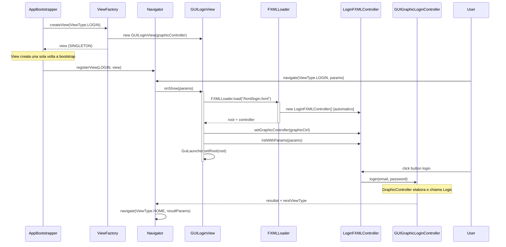
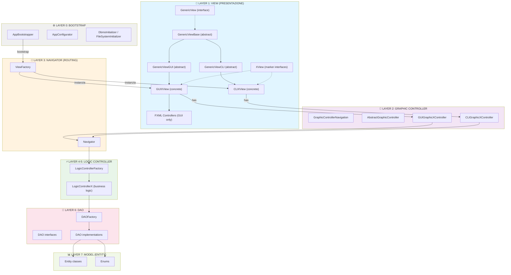
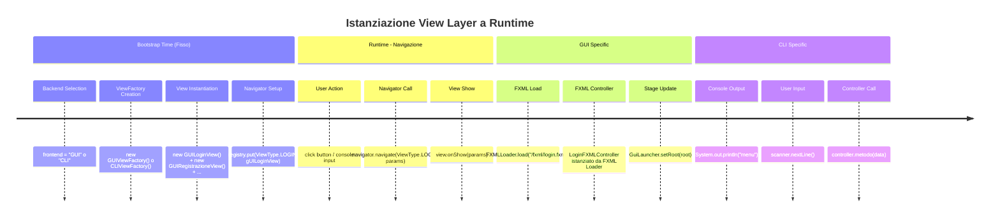

# 🎨 MVC DIAGRAM - LAYER VIEW (Mermaid)

## Diagramma Gerarchico delle Classi

```mermaid
classDiagram
    %% Interface
    class GenericView {
        <<interface>>
        +onShow()
        +onShow(Map params)
        +onHide()
        +readSession(Map params)
        +readError(Map params)
        +readSuccess(Map params)
    }

    %% Abstract Base
    class GenericViewBase {
        <<abstract>>
        #sessione: SessioneUtenteBean
        #lastParams: Map
        +getSessione()
        +getLastParams()
        +getLastError()
        +getLastSuccess()
    }

    %% Specialized Abstracts
    class GenericViewGUI {
        <<abstract>>
    }

    class GenericViewCLI {
        <<abstract>>
    }

    %% Marker Interfaces
    class ViewLogin {
        <<interface>>
    }

    class ViewRegistrazione {
        <<interface>>
    }

    class ViewPrenotazione {
        <<interface>>
    }

    class ViewGestioneAccount {
        <<interface>>
    }

    class ViewDisdetta {
        <<interface>>
    }

    class ViewGestioneRegole {
        <<interface>>
    }

    class ViewLog {
        <<interface>>
    }

    class ViewPenalita {
        <<interface>>
    }

    %% Concrete GUI Views
    class GUILoginView {
        -controller: GUIGraphicLoginController
        -fxmlController: LoginFXMLController
        +onShow(Map params)
    }

    class GUIRegistrazioneView {
        -controller: GUIGraphicRegistrazioneController
        -fxmlController: RegistrazioneFXMLController
        +onShow(Map params)
    }

    class GUIPrenotazioneView {
        -controller: GUIGraphicPrenotazioneController
        -fxmlController: PrenotazioneFXMLController
        +onShow(Map params)
    }

    class GUIAccountView {
        -controller: GUIGraphicAccountController
        -fxmlController: AccountFXMLController
        +onShow(Map params)
    }

    class GUIDisdettaView {
        -controller: GUIGraphicDisdettaController
        -fxmlController: DisdettaFXMLController
        +onShow(Map params)
    }

    class GUIRegoleView {
        -controller: GUIGraphicRegoleController
        -fxmlController: RegoleFXMLController
        +onShow(Map params)
    }

    class GUILogView {
        -controller: GUIGraphicLogController
        -fxmlController: LogFXMLController
        +onShow(Map params)
    }

    class GUIPenalitaView {
        -controller: GUIGraphicPenalitaController
        -fxmlController: PenalitaFXMLController
        +onShow(Map params)
    }

    %% Concrete CLI Views
    class CLILoginView {
        -controller: CLIGraphicLoginController
        -in: Scanner
        +onShow(Map params)
    }

    class CLIRegistrazioneView {
        -controller: CLIGraphicRegistrazioneController
        -in: Scanner
        +onShow(Map params)
    }

    class CLIPrenotazioneView {
        -controller: CLIGraphicPrenotazioneController
        -in: Scanner
        +onShow(Map params)
    }

    class CLIAccountView {
        -controller: CLIGraphicAccountController
        -in: Scanner
        +onShow(Map params)
    }

    class CLIDisdettaView {
        -controller: CLIGraphicDisdettaController
        -in: Scanner
        +onShow(Map params)
    }

    class CLIRegoleView {
        -controller: CLIGraphicRegoleController
        -in: Scanner
        +onShow(Map params)
    }

    class CLILogView {
        -controller: CLIGraphicLogController
        -in: Scanner
        +onShow(Map params)
    }

    class CLIPenalitaView {
        -controller: CLIGraphicPenalitaController
        -in: Scanner
        +onShow(Map params)
    }

    %% FXML Controllers (GUI only)
    class LoginFXMLController {
        -graphicController: GUIGraphicLoginController
        +handleLogin()
        +setGraphicController()
        +initWithParams()
    }

    class RegistrazioneFXMLController {
        -graphicController: GUIGraphicRegistrazioneController
        +handleRegistrazione()
    }

    class PrenotazioneFXMLController {
        -graphicController: GUIGraphicPrenotazioneController
        +handlePrenotazione()
    }

    %% Hierarchy
    GenericView <|-- GenericViewBase
    GenericViewBase <|-- GenericViewGUI
    GenericViewBase <|-- GenericViewCLI

    GenericView <|.. ViewLogin
    GenericView <|.. ViewRegistrazione
    GenericView <|.. ViewPrenotazione
    GenericView <|.. ViewGestioneAccount
    GenericView <|.. ViewDisdetta
    GenericView <|.. ViewGestioneRegole
    GenericView <|.. ViewLog
    GenericView <|.. ViewPenalita

    %% GUI Implementations
    GenericViewGUI <|-- GUILoginView
    GenericViewGUI <|-- GUIRegistrazioneView
    GenericViewGUI <|-- GUIPrenotazioneView
    GenericViewGUI <|-- GUIAccountView
    GenericViewGUI <|-- GUIDisdettaView
    GenericViewGUI <|-- GUIRegoleView
    GenericViewGUI <|-- GUILogView
    GenericViewGUI <|-- GUIPenalitaView

    ViewLogin <|.. GUILoginView
    ViewRegistrazione <|.. GUIRegistrazioneView
    ViewPrenotazione <|.. GUIPrenotazioneView
    ViewGestioneAccount <|.. GUIAccountView
    ViewDisdetta <|.. GUIDisdettaView
    ViewGestioneRegole <|.. GUIRegoleView
    ViewLog <|.. GUILogView
    ViewPenalita <|.. GUIPenalitaView

    %% CLI Implementations
    GenericViewCLI <|-- CLILoginView
    GenericViewCLI <|-- CLIRegistrazioneView
    GenericViewCLI <|-- CLIPrenotazioneView
    GenericViewCLI <|-- CLIAccountView
    GenericViewCLI <|-- CLIDisdettaView
    GenericViewCLI <|-- CLIRegoleView
    GenericViewCLI <|-- CLILogView
    GenericViewCLI <|-- CLIPenalitaView

    ViewLogin <|.. CLILoginView
    ViewRegistrazione <|.. CLIRegistrazioneView
    ViewPrenotazione <|.. CLIPrenotazioneView
    ViewGestioneAccount <|.. CLIAccountView
    ViewDisdetta <|.. CLIDisdettaView
    ViewGestioneRegole <|.. CLIRegoleView
    ViewLog <|.. CLILogView
    ViewPenalita <|.. CLIPenalitaView

    %% FXML Dependencies (GUI only)
    GUILoginView --> LoginFXMLController
    GUIRegistrazioneView --> RegistrazioneFXMLController
    GUIPrenotazioneView --> PrenotazioneFXMLController
```

---

## Diagramma di Istanziazione a Runtime

---

## Diagramma Pacchetto (Directorio)

```mermaid
graph TD
    A["com.ispw.view"] --> B["interfaces/"]
    A --> C["common/"]
    A --> D["gui/"]
    A --> E["cli/"]
    A --> F["shared/"]

    B --> B1["GenericView.java"]
    B --> B2["ViewLogin.java"]
    B --> B3["ViewRegistrazione.java"]
    B --> B4["ViewPrenotazione.java"]
    B --> B5["ViewGestioneAccount.java"]
    B --> B6["ViewDisdetta.java"]
    B --> B7["ViewGestioneRegole.java"]
    B --> B8["ViewLog.java"]
    B --> B9["ViewPenalita.java"]

    C --> C1["GenericViewBase.java"]

    D --> D1["GenericViewGUI.java"]
    D --> D2["GUILoginView.java"]
    D --> D3["GUIRegistrazioneView.java"]
    D --> D4["GUIPrenotazioneView.java"]
    D --> D5["GUIAccountView.java"]
    D --> D6["GUIDisdettaView.java"]
    D --> D7["GUIRegoleView.java"]
    D --> D8["GUILogView.java"]
    D --> D9["GUIPenalitaView.java"]
    D --> D10["GuiLauncher.java"]
    D --> D11["GuiViewUtils.java"]
    D --> D12["fxml/"]
    
    D12 --> D12A["login.fxml"]
    D12 --> D12B["LoginFXMLController.java"]
    D12 --> D12C["registrazione.fxml"]
    D12 --> D12D["RegistrazioneFXMLController.java"]
    D12 --> D12E["...altri FXML e Controller..."]

    E --> E1["GenericViewCLI.java"]
    E --> E2["CLILoginView.java"]
    E --> E3["CLIRegistrazioneView.java"]
    E --> E4["CLIPrenotazioneView.java"]
    E --> E5["CLIAccountView.java"]
    E --> E6["CLIDisdettaView.java"]
    E --> E7["CLIRegoleView.java"]
    E --> E8["CLILogView.java"]
    E --> E9["CLIPenalitaView.java"]
    E --> E10["CliViewUtils.java"]
```

---

## Diagramma MVC Completo (con View Layer)

---

## Flusso di Istanziazione a Runtime (Timeline)

